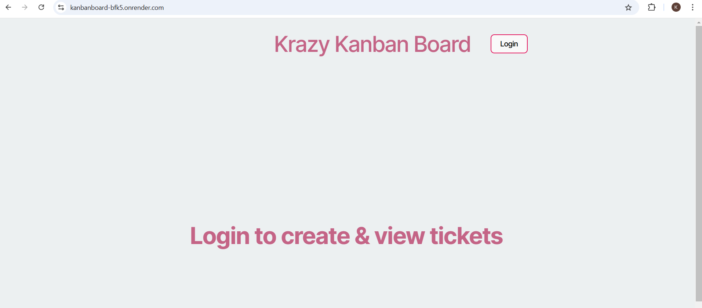
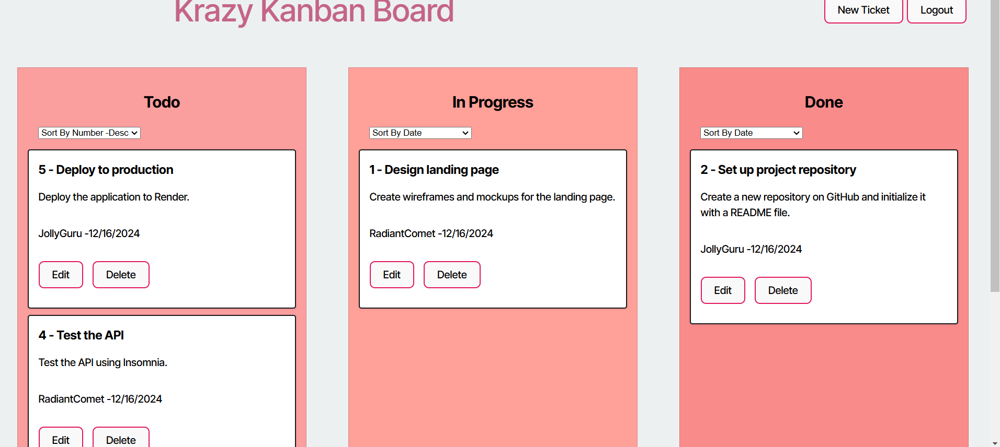

# Kanban Board
To add authentication with JWT to an existing Kanban board application.

 To protect the password, the password will not be stored as is, it will be hashed using bcrypt while storing. We will also be using bcrypt while authenticating the user.Then we will use JWT for verifying user identities URL-safe tokens that encode a user's authentication data, allowing servers to authenticate requests.

 When the User logins to the app, then the user will be able to create or edit tickets. The ticketid,Description,creation date will be displayed.The app also allows the user to sort the tickets by date or number.

## Table of Contents 
- [Kanban Board](#kanban-board)
  - [Table of Contents](#table-of-contents)
  - [Installation](#installation)
  - [Usage](#usage)
  - [Demo](#demo)
  - [ScreenShots](#screenshots)
  - [License](#license)
  - [Questions](#questions)

## Installation
1. Clone the repository:
    git clone git@github.com:gitkaviyarasi/Kanbanboard.git
2. Navigate to the project directory and create a branch and open Code editor.
3. Install the package using npm i
4. setup the Db Dbname,username, password,JWT token.
5. then run the code using npm run start:dev 
   
## Usage
Run `npm run start:dev` and navigate to the prompted URL to see your app in dev. 

## Demo
The App is deployed to Render, Click the below link for working application.
https://kanbanboard-bfk5.onrender.com/ 

## ScreenShots
The following image demonstrates the web application's appearance:

## License
MIT

## Questions
If you have any questions about this project, feel free to reach out:

GitHub: gitkaviyarasi 
Email: kaviyarasikrishnannj@gmail.com